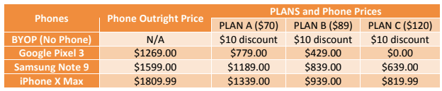

# COMP248_A2-Q3
CellphoneHub is cellphone plan comparison service that helps user choose an appropriate phone plan in Canada. They currently provide details for three different plans and support 3 different cell phone models. The details are mentioned below. 
Three cellphone models available are Google Pixel 3, Samsung Note 9 and iPhone X Max. 
There are three family cell phone plans available (all of them are 2 year plans):

<pre>       (1) Plan A – (Canada wide calling with 4GB shared data)</pre>
<pre>       (2) Plan B – (Canada wide calling with 10GB shared data)</pre>
<pre>       (3) Plan C – (Canada wide calling with 12GB shared data)</pre>
You can add as many lines to the shared plan as you want and you will get $10 discount for each
added line. You also get $10 discount if you bring your own phone (BYOP). The details for cell
phone discounts with each plan and along with plan price tags are tabulated below. 

 Write a program that helps a user decide which plan works better for him. The program should ask the user to enter the total number of phone lines and whether or not a phone needs to be purchased with each line. 
Compare all three plan costs and provide the user with all his options. 
Here are a few sample outputs to illustrate the expected behavior of your program:

 

